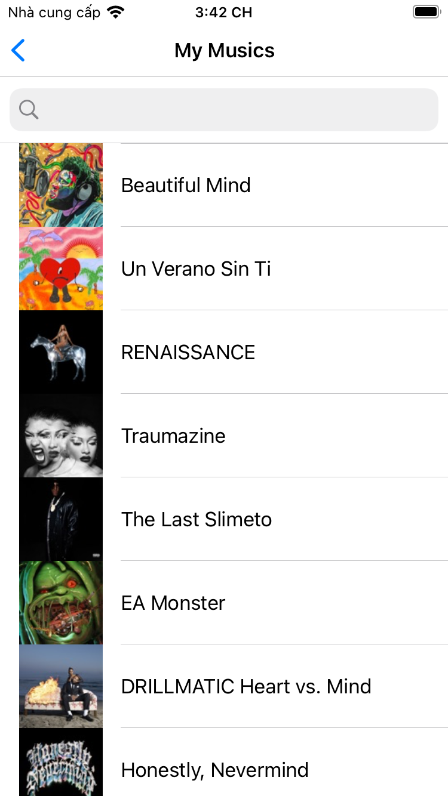

# RxSwift Advance

## I. Handle API

### 1. Fetching data

#### Đầu tiên tạo 1 `singleton` có tên là `ApiManager` để handle các việc xử lý liên quan đến API

```swift

class ApiManager {
    static let shared: ApiManager = ApiManager()
    let baseUrl: String = "https://rss.applemarketingtools.com/api/v2/us/music/most-played/10/albums.json"
}

extension ApiManager {
    enum Method: String {
        case get
        case post
        case put
        case delete
    }
}

enum APIError: Error {
    case pathError
    case error(String)
    
    var localizedDescription: String {
        switch self {
        case .pathError:
            return "URL not found"
        case .error(let errorMessage):
            return errorMessage
        }
    }
}
```

 - ApiManger gồm 1 `singleton` là `shared`, `baseUrl` và 1 `enum` define các `method` để truyền vào `function` triển khai sau đó, `enum` define về `error` mình muốn handle.

#### - Đây là phần call api với `URLSession` hay dùng

```swift
func loadAPI(method: Method, completion: @escaping Completion) {
    //create request
    let url = URL(string: urlString)
    var request = URLRequest(url: url!)
    request.httpMethod = method.rawValue
    
    //config
    let config = URLSessionConfiguration.ephemeral
    config.waitsForConnectivity = true

    //session
    let session = URLSession(configuration: config)
    
    //connect
    let task = session.dataTask(with: request) { (data, response, error) in
        DispatchQueue.main.async {
            if let error = error {
                completion(false, error.localizedDescription)
            } else {
                if let data = data {
                    let json = data.toJSON()
            
                    completion(json, nil)
                } else {
                   completion(nil, "Data format is error.")
                }
            }
        }
    }
        
    task.resume()
 }
```

#### - Đây là phần chúng ta sẽ convert sang `RxSwift`

```swift
func loadAPI<T: Decodable>(method: Method) -> Single<T> {
    return Single<T>.create { [weak self] single -> Disposable in
        guard let this = self,
              let path = URL(string: this.baseUrl) else {
            single(.error(APIError.pathError))
            return Disposables.create()
        }
        let observable = Observable<URL>.just(path)
            .map { path in
                var request = URLRequest(url: path)
                request.httpMethod = method.rawValue
                request.addValue("application/json", forHTTPHeaderField: "Content-type")
                return request
            }
            .flatMap { urlRequest -> Observable<(response: HTTPURLResponse, data: Data)> in
                return URLSession.shared.rx.response(request: urlRequest)
            }
        
        observable.subscribe { (response, data) in
            do {
                let modal: T = try JSONDecoder().decode(T.self, from: data)
                single(.success(modal))
            } catch {
                single(.error(APIError.error("Fail parse data")))
            }
        } onError: { error in
            single(.error(error))
        } onCompleted: {
            print("completed")
        } onDisposed: {
            print("disposed")
        }
        .disposed(by: this.disposedBag)
        
        return Disposables.create()
    }
    .observeOn(MainScheduler.instance)
}
```

#### - Khi ta đã có func call API và giờ chúng ta sẽ gọi ở `viewModel` của `controller` chúng ta muốn lấy dữ liệu về.

```swift
final class MusicListViewModel {
    var behaviorRelay: BehaviorRelay<[Music]> = .init(value: [])
    var loadingReplay: BehaviorRelay<Bool> = .init(value: false)
    var musics: [Music] = []

    func getApiMusic() -> Single<FeedResults> {
        return ApiManager.shared.loadAPI(method: .get)
    }
}
```

- Phần này gồm có model để map data theo kiểu json về thì mọi người xem ở phần code demo để hiểu rõ về chi tiết
- Theo tính chất của `Single` nó phù hợp cho việc call API vì nó chỉ trả về hoặc là `.success(data)` hoặc là `.error(error)` để handle cho việc xử lý data và hiển thỉ lại `UI` hay là `error`.

#### - Tiếp theo ở `viewController` chúng ta sẽ get data từ `viewModel`

```swift
private func callAPI(_ query: String = "") {
    viewModel.getApiMusic()
        .subscribe { [weak self] data in
            guard let this = self else { return }
            this.viewModel.loadingReplay.accept(false)
            this.viewModel.musics = data.results ?? []
            this.search(query)
        } onError: { error in
            self.viewModel.loadingReplay.accept(true)
            print(error.localizedDescription)
        }
        .disposed(by: disposedBag)
}
    
private func search(_ query: String) {
    if !query.isEmpty {
        viewModel.behaviorRelay.accept(viewModel.musics.filter { $0.name?.uppercased().contains(query.uppercased()) ?? false })
    } else {
        viewModel.behaviorRelay.accept(viewModel.musics)
    }
}
```

- Thì như chúng ta thấy: `viewModel.getApiMusic()` nó chỉ trả về là `onNext` và `onError` tương ứng với 2 phần đó ta có xử lý ứng vs hiển thị data và hiển thị popup error.
- Sau khi có data rồi thì việc xử lý của chúng ta là add dữ liệu vào `tableView` để hiển thị lên UI người dùng.

```swift
private func setupTableView() {
    tableView.register(UITableViewCell.self, forCellReuseIdentifier: "cell")
    tableView.rx.setDelegate(self)
        .disposed(by: disposedBag)

    viewModel.behaviorRelay.bind(to: tableView.rx.items(cellIdentifier: "cell")) { (index, element, cell) in
        cell.textLabel?.text = element.name
        if let urlString = element.artworkUrl100 {
            cell.imageView?.image = UIImage(url: URL(string: urlString))
        }

        if let lastIndexVisible = self.tableView.indexPathsForVisibleRows?.last,
           lastIndexVisible.row == index {
            self.viewModel.loadingReplay.accept(true)
        }
    }
    .disposed(by: disposedBag)
    
    tableView.rx.modelDeselected(Music.self)
        .subscribe { event in
            print(event.element)
        }
        .disposed(by: disposedBag)
}
```

- Phần này là phần binding data vào tableView



### Vậy là đã xong phần connect API

