# RxSwift
## I. Observable
### 1. Definition
- Observable : là nguồn phát ra dữ liệu mà các đối tượng khác có thể quan sát được và đăng ký tới được.
	
### 2. Life Cycle
Vòng đời của 1 Observable là bắn những giá trị mà nó có. Với 3 kiểu giá trị mà nó được phép bắn đi.

* **Value**: giá trị của nguồn phát ( emit)
* **Error**: lỗi trong quá trình hoạt động
* **Completed**: Hoàn thành vòng đời
	

### 3. Create Observables
#### a. create()

```
return Observable.create { observer in 
    self.someAsyncOpertation { success: Bool in 
        if success {
            observer.onNext(()) //It sends a void into the AnyObserver<Void>
            observer.onCompleted()
        } else {
            observer.onError(MyError())
        }
    }
    return Disposables.create()
}
```

- deferred

```
    let bag = DisposeBag()
    
    var flip = true
    
    let factory = Observable<Int>.deferred {
        flip.toggle()
        
        if flip {
            return Observable.of(1)
        } else {
            return Observable.of(0)
        }
    }
```
	- bag: túi rác quốc dân
	- flip: cờ lật qua lật lại
	- nếu flip == true thì Observable phát giá trị 1 và ngược lại là 0


#### b. just
- Là toán tử phát ra 1 phần tử duy nhất rồi kết thúc.

```swift
	let observable = Observable<Int>.just(1)
```
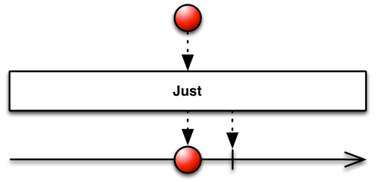

#### c. of

```swift
	let observable = Observable.of(1,2,3)
	observable.subscribe { print("observable:", $0) }
```
	
- Không cần khai báo kiểu dữ liệu cho output. Thư viện sẽ nội suy kiểu dữ liệu tương ứng cung cấp trong `of(...)`
- Kết quả:

```
	observable: next(1)
	observable: next(2)
	observable: next(3)
	observable: completed
```

#### d. from

```swift
	let observable = Observable.from([1,2,3])
	observable.subscribe { print("observable:", $0) }
```
	
- Sử dụng toán tử `from()`, tham số đầu vào là 1 `array`. và kiểu dữ liệu đầu ra là kiểu `Int`
- Kết quả:

```
	observable: next(1)
	observable: next(2)
	observable: next(3)
	observable: completed
```

### 4. Subscribe & Handle events
- Dùng biến observable đã khai báo `Observable` và gọi toán tử `.subscribe` để tạo 1 `subscription` để nhận dữ liệu.

```
let observable = Observable.of(1,2,3)
observable.subscribe { print($0) }
```
or

```
	observable.subscribe(onNext: { (value) in
        print(value)
    }, onError: { (error) in
        print(error.localizedDescription)
    }, onCompleted: {
        print("Completed")
    }) {
        print("Disposed")
    }
```

### 5. Special observables
#### a. Empty
- Đây là toán tự tạo ra 1 Observable, nó đặc biệt là không phát ra phần tử nào và sẽ kết thúc sau đó. 

```
    let observable = Observable<Void>.empty()
    
    observable.subscribe(
      onNext: { element in
        print(element)
    },
      onCompleted: {
        print("Completed")
      }
    )
```

#### b. Never
- Toán tử `.empty` nó khác với `.never` nha. `Never` thì sẽ không phát ra gì cả và cũng không kết thúc luôn.

```
    let observable = Observable<Void>.never()
    
    observable.subscribe(
      onNext: { element in
        print(element)
    },
      onCompleted: {
        print("Completed")
      }
    )
```

#### b. Ranger
- Nó giống như một vòng `for` đơn giản. Observable với kiểu phần tử được phát đi là `Int`. Chúng sẽ phát ra lần lượt, số lần phát chính là count và giá trị bắt đầu phát ra là `start`. Sau mỗi lần phát thì `start` sẽ được tăng lên 1 đơn vị.

```
    let observable = Observable<Int>.range(start: 1, count: 10)
    var sum = 0
    observable
        .subscribe(
            onNext: { i in
                sum += i
        } , onCompleted: {
            print("Sum = \(sum)")
        }
    )
```

## II. Traits
	- Nó không xảy ra lỗi
	- Được observe và subcribe trên Main Scheduler
	- Không chia sẻ Side Effect

### 1. Single
- Thay vì emit được ra 1 chuỗi các elements như Observable thì Singgle sẽ chỉ emit ra duy nhất 1 element hoặc 1 error.
- Không chia sẻ Side Effect

```
 enum FileError: Error {
     case pathError
 }
 
 let bag = DisposeBag()
 
 func readFile(_ path: String? = nil) -> Single<String> {
     return Single.create { single -> Disposable in
         if let path = path  {
             single(.success("Success! \(path)"))
         } else {
             single(.error(FileError.pathError))
         }
         
         return Disposables.create()
     }
 }

readFile().subscribe { print($0)}
	.disposed(by: bag)
readFile("google.com").subscribe { print($0)}
	.disposed(by: bag)
```
 
 - Kết quả
 
```
error(__lldb_expr_12.FileError.pathError)
success("Success! google.com")
```
 
### 2. Completable
- Giống với Single, Completable cũng là 1 biến thể của Observable
- Khác nhau là Completable nó chỉ có thể emit ra 1 error hoặc complete (không emit ra event mà chỉ terminate)
- Không chia sẻ Side Effect

```
let bag = DisposeBag()

enum FileError: Error {
    case pathError
    case failedCaching
}

func cacheLocally() -> Completable {
    return Completable.create { completable in
       // Store some data locally
       //...
       //...
        
        let success = true

       guard success else {
           completable(.error(FileError.failedCaching))
           return Disposables.create {}
       }

       completable(.completed)
       return Disposables.create {}
    }
}

cacheLocally().subscribe { print($0) }
    .disposed(by: bag)
```

### 3. Maybe
- Maybe là sự kết hợp giữa Single và Completable
- Nó có thể emit ra 1 element, complete mà không emit ra element hoặc emit 1 error. Sau khi phát ra bất kỳ 1 trong 3 sự kiện nêu trên thì Maybe cũng terminate.

```
let bag = DisposeBag()

enum MyError: Error {
    case anError
}

func convertNumber(_ str: String?) -> Maybe<Any> {
    return Maybe<Any>.create { maybe in
        if let str = str {
            if let number = Int(str) {
                maybe(.success(number))
            } else {
                maybe(.error(MyError.anError))
            }
        } else {
            maybe(.completed)
        }
        return Disposables.create {}
    }
}
func printResult(_ str: String? = nil) {
    convertNumber(str).subscribe { event in
        switch event {
        case .completed:
            print("Completed!")
        case .success(let str):
            print("Success: \(str)")
        case .error(let error):
            print("Error: \(error.localizedDescription)")
        }
    }
}

printResult()
printResult("1")
printResult("a")
```

- Kết quả

```
Completed!
Success: 1
Error: The operation couldn’t be completed. (__lldb_expr_18.MyError error 0.)
```

- **Có thể chuyển đổi từ Observable sequence thành 1 Traits thông qua 2 toán tử:**
	- `.asSingle()`
	- `.asMaybe()`

## III. Subject
### 1. Replay Subject
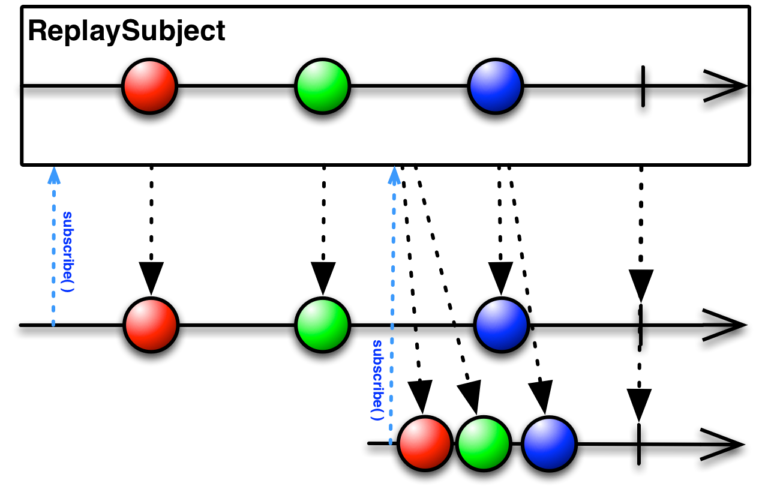

	- Khởi tạo bằng kich thước bộ đệm của subject
	- Khi phát đi 1 phần tử thì đồng thời lưu trữ nó vào bộ đệm
	- Khi có subscribẻ mới tới thì sẽ nhận được toàn bộ phần tử trong bộ đệm

```
// Bộ đệm lưu trữ tối đa 2 phần tử
let subject = ReplaySubject<String>.create(bufferSize: 2)

// Bộ đệm lưu trữ tất cả các giá trị
let subject = ReplaySubject<String>.createUnbounded()
```

```
let subject = ReplaySubject<String>.create(bufferSize: 2)

// emit
subject.onNext("1")
subject.onNext("2")
subject.onNext("3")

// subcribe 1
subject
  .subscribe { print("🔵 ", $0) }
  .disposed(by: disposeBag)

// emit
subject.onNext("4")

// subcribe 2
subject
  .subscribe { print("🔴 ", $0) }
  .disposed(by: disposeBag)

// error
subject.onError(MyError.anError)

// dispose
subject.dispose()

// subcribe 3
subject
  .subscribe { print("🟠 ", $0) }
  .disposed(by: disposeBag)

```

- Kết quả
	- Với `ReplaySubject<String>.create(bufferSize: 2)`
	
	```
	🔵  next(2)
	🔵  next(3)
	🔵  next(4)
	🔴  next(3)
	🔴  next(4)
	🔵  error(anError)
	🔴  error(anError)
	🟠  error(Object `RxSwift.(unknown context at $10762c020).ReplayMany<Swift.String>` was already disposed.)
	```
	- Với `ReplaySubject<String>.createUnbounded()`

	```
	🔵  next(1)
	🔵  next(2)
	🔵  next(3)
	🔵  next(4)
	🔴  next(1)
	🔴  next(2)
	🔴  next(3)
	🔴  next(4)
	🔵  error(anError)
	🔴  error(anError)
	🟠  error(Object `RxSwift.(unknown context at $103ba00ec).ReplayAll<Swift.String>` was already disposed.)
	```
	
### 2. Behavior Subjects


	- Luôn cung cấp giá trị ban đầu cho phần tử của suvject khi khởi tạo
	- Các subscriber khi subcribe tới subject thì luôn nhận được giá trị đầu tiên tương ứng với giá trị mới nhất.
	- Khi subject kết thúc thì các subcribers mới sẽ nhận được .error hay .completed.

```swift
let disposeBag = DisposeBag()

enum MyError: Error {
  case anError
}

let subject = BehaviorSubject(value: "0")

//Subscribe 1
subject .subscribe {
    print("🔵 ", $0)
  }
.disposed(by: disposeBag)

// emit
subject.onNext("1")

//Subscribe 2
subject .subscribe {
    print("🔴 ", $0)
  }
.disposed(by: disposeBag)

// error
subject.onError(MyError.anError)

//Subscribe 3
subject .subscribe {
    print("🟠 ", $0)
  }
.disposed(by: disposeBag)
	
```

- Kết quả

```
🔵  next(0)
🔵  next(1)
🔴  next(1)
🔵  error(anError)
🔴  error(anError)
🟠  error(anError)
```

### 3. Publish Subject
	- Chỉ phát ra giá trị mới nhất
	- Các subscriber chỉ nhận được giá trị sau khi subcribe và subject phát giá trị
	- Subject kết thúc khi phát đi .complete hoặc .error
	- Subscription kết thúc khi nó .dispose()

```swift
    let disposeBag = DisposeBag()
    let subject = PublishSubject<String>()
    
    subject.onNext("1")
    
        // subscribe 1
    let subscription1 = subject
        .subscribe(onNext: { value in
            print("Sub 1: ", value)
        }, onCompleted: {
            print("sub 1: completed")
        })
        
        // emit
    subject.onNext("2")
    
        // subscribe 2
    let subscription2 = subject
        .subscribe(onNext: { value in
            print("Sub 2: ", value)
        }, onCompleted: {
            print("sub 2: completed")
        })
    
        // emit
    subject.onNext("3")
    subject.onNext("4")
    subject.onNext("5")

    // dispose subscription2
    subscription2.dispose()

        // emit
    subject.onNext("6")
    subject.onNext("7")

    // completed
    subject.on(.completed)
        // emit
    subject.onNext("8")
    
        // subscribe 3
    subject .subscribe {
        print("sub 3: ", $0.element ?? $0)
    }
    .disposed(by: disposeBag)
```

- Kết quả

```
Sub 1:  2
Sub 1:  3
Sub 2:  3
Sub 1:  4
Sub 2:  4
Sub 1:  5
Sub 2:  5
Sub 1:  6
Sub 1:  7
sub 1: completed
sub 3:  completed
```

- `subject.onNext("1")`: subject phát giá trị khi chưa có subscription nào thì subscriber không nhận được giá trị `"1"`
- `subscription2.dispose()`: subscription2 đã `.dispose()`là đã kết thúc phiên làm việc nên không nhận được giá trị là `"6", "7"`
- `subject.on(.completed)`. lần này subject trả về `.completed` nên nó kết thúc. Khi đó subscription3 chỉ nhận được `.completed` chứ k nhận được giá trị là `"8"` vì subject đã kết thúc nên không phát ra `"8"`.

### 4. Relays
> #### Import RxCocoa

#### a. Publish Relays
	- Publish Relay nó mang các đặc tính của Publíh Subject.
	- Khi subject `emit` dữ liệu đi thì dùng `.accept` thay cho `onNext`
	- Không thể kết thúc Reláy vì nó không hề phát đi error hay completed. Việc phát đi 2 giá trị này thì đều bị trình biên dịch ngăn cản.

```
let disposeBage = DisposeBag()

enum MyError: Error {
    case anError
}

let publishRelay = PublishRelay<String>()

publishRelay.accept("0")

publishRelay.subscribe { print("🔵 ", $0)}

publishRelay.accept("1")
publishRelay.accept("2")
publishRelay.accept("3")

publishRelay.subscribe{ print("🔴 ", $0) }

publishRelay.accept("4")

publishRelay.accept(MyError.anError) // Cannot convert value of type 'MyError' to expected argument type 'String'
```

#### b. BehaviorRelay
	- Behavior Relay lại mang các đặc tính của Behavior Subject
	- Behavior Relay có thể lấy được giá trị hiện tại đang lưu trữ trong Relay.
	// current value
    print("Current value: \(behaviorRelay.value)")

### 5. Async Subject
	- Có duy nhất 1 giá trị cuối cùng trước lúc gọi `.onCompleted()` được nhận bởi subscriber

```swift
let bag = DisposeBag()

let asyncSubject = AsyncSubject<Int>()

asyncSubject.onNext(1)

asyncSubject.subscribe { print($0) }
    .disposed(by: bag)

asyncSubject.onNext(2)

asyncSubject.onCompleted()

asyncSubject.onNext(3)
```

```
next(2)
completed
```

## IV. Operators
### 1. Filtering Operators
#### a. Ignoring Operators
- `ignoreElement()`: không muốn nhật tất cả các elements từ 1 Observable. Tuy nhiên nó sẽ cho phép nhận các sự kiện `.completed` & `.error`.

```swift
 let subject = PublishSubject<String>()
    let bag = DisposeBag()
    
    subject
    .ignoreElements()
        .subscribe { event in
              print(event)
            }
        .disposed(by: bag)
    
    subject.onNext("1")
    subject.onNext("2")
    subject.onNext("3")
    
    subject.onCompleted()
```

- `elementAt(_:)`: Toán tử này sẽ lấy phần tử thứ n.

```swift
    let subject = PublishSubject<String>()
    let bag = DisposeBag()
    
    subject
    .elementAt(2)
        .subscribe { event in
              print(event)
            }
        .disposed(by: bag)
    
    subject.onNext("1")
    subject.onNext("2")
    subject.onNext("3")
    
    subject.onCompleted()
```

```
next(3)
completed
```

- `filter()`:

```swift
    let bag = DisposeBag()
    let array = Array(0...10)
    
    Observable.from(array)
        .filter { $0 % 2 == 0 }
        .subscribe(onNext: {
            print($0) })
        .disposed(by: bag)
```

#### b. 	Skip Operators
- `skip(_:)`: Subscriber sẽ nhận các phần tử thứ n cho đến khi Observable kết thúc.

```
    let disposeBag = DisposeBag()
    
    Observable.of("A", "B", "C", "D", "E", "F")
        .skip(3) 
        .subscribe(onNext: {
            print($0) })
        .disposed(by: disposeBag)
```

```
D
E
F
```

- `skipWhile()`: Nó tương tự `filter` tuy nhiên nó sẽ bỏ qua phần tử thoả mãn nó (true) và từ phần tử đầu tiên không thoả mãn điểu kiện(false) thì kết thúc quá trình lọc. Các phần tử tiếp theo sau đó vẫn nhận được như thường

```
    let bag = DisposeBag()
    
    Observable.of(2, 4, 8, 9, 2, 4, 5, 7, 0, 10)
        .skipWhile { $0 % 2 == 0 }
        .subscribe(onNext: {
            print($0) })
        .disposed(by: bag)
```

```
9
2
4
5
7
0
10
```

- `skipUntil(_:)`: sử dụng điều kiện động. Ở đây chúng ta dùng 1 observable khác để làm điều kiện.

```
subject
    .skipUntil(trigger)
    .subscribe(onNext: { value in
        print(value)
    })
    .disposed(by: bag)

subject.onNext("1")

trigger.onNext("Stop")

subject.onNext("2")
subject.onNext("3")
```

```
2
3
```

#### c. Taking Operators
- `take(_:)`: nó quy đinh lấy số lượng phần tử cần lấy từ Observabke phát đi. Nếu đủ số lượng thì tự động kết thúc.

```swift
let bag = DisposeBag()

Observable<Any>.of("1", 2, "3", 4, "5", 2.2, [1,2])
    .take(7)
    .subscribe(onNext: { (value) in
        print(type(of: value))
    })
    .disposed(by: bag)

```

```
String
Int
String
Int
String
Double
Array<Int>
```

- `takeWhile{ }`: Toán tử này giúp bạn lấy hết những giá trị thoả mãn điều kiên. Cho tới khi phần tử đầu tiên không thoả mãn nữa thì các phần tử sau đó sẽ không nhận được.
- `enumerated()`: Nó sẽ thêm `index` cho giá trị của bạn. Kiểu giá trị mới mà subscriber nhận được là 1 Tuple (index, element).

```swift
let bag = DisposeBag()

Observable.of(2, 4, 6, 8, 0, 12, 1, 3, 4, 6, 2)
    .enumerated()
    .takeWhile { index, value in
        value % 2 == 0 && index < 3
    }
    .subscribe(onNext: { (value) in
        print(value)
    })
    .disposed(by: bag)
```

```
(index: 0, element: 2)
(index: 1, element: 4)
(index: 2, element: 6)
```

- `takeUntil(_:)`: Nó giúp lấy tất cả các phần tử đầu tiên thoả mãn điều kiện đông là 1 observable

#### d. Distinct Operators
- **Equatable Type**

```
let bag = DisposeBag()

Observable.of("1", "1", "2", "1", "3",nil, nil, "1", "1")
    .distinctUntilChanged()
    .subscribe { print($0)}
    .disposed(by: bag)
```

```
next(Optional("1"))
next(Optional("2"))
next(Optional("1"))
next(Optional("3"))
next(nil)
next(Optional("1"))
completed
```

- **Custom Type**

```
    struct Point {
        var x: Int
        var y: Int
    }
    
    let disposeBag = DisposeBag()
    
    let array = [ Point(x: 0, y: 1),
                  Point(x: 0, y: 2),
                  Point(x: 1, y: 0),
                  Point(x: 1, y: 1),
                  Point(x: 1, y: 3),
                  Point(x: 2, y: 1),
                  Point(x: 2, y: 2),
                  Point(x: 0, y: 0),
                  Point(x: 3, y: 3),
                  Point(x: 0, y: 1)]
    
    Observable.from(array)
        .distinctUntilChanged { (p1, p2) -> Bool in
            p1.x == p2.x
        }
        .subscribe(onNext: { point in
            print("Point (\(point.x), \(point.y))")
        })
        .disposed(by: disposeBag)
```

```
Point (0, 1)
Point (1, 0)
Point (2, 1)
Point (0, 0)
Point (3, 3)
Point (0, 1)
```

### 2. Transforming Operators
#### a. Transforming Operators
- `toArray`: gom tất cả các phần tử thành 1 array. Nó biến đổi Observable thành 1 `Single`. Khi đó chỉ cho phép trả về là `.onSuccess` hoặc `.error` mà thôi.

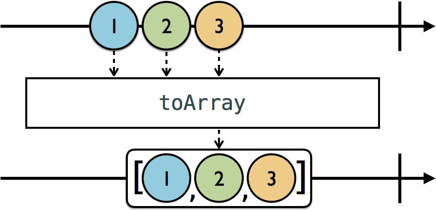

- `map`: Biến đổi từ kiểu dữ liệu này thành kiểu dữ liệu khác.

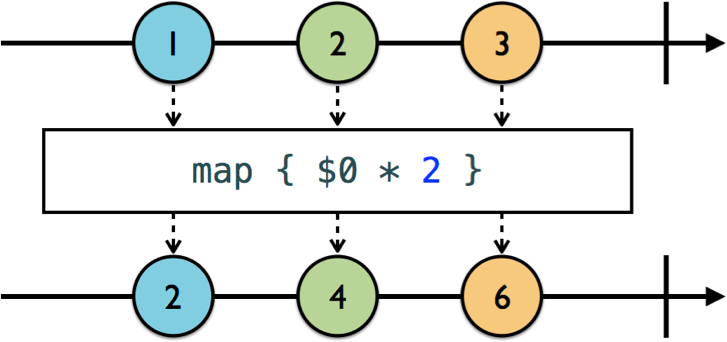

#### b. Transforming Inner observables
- `flatMap`: Kiểu dữ liệu đầu vào cho các elements thuộc kiểu Observable. Vì element có kiểu Observabke nên nó phát dữ liệu được. Lúc này sẽ tạo ra nhiều stream.
	- Muốn nhận tất cả dữ liệu phát ra từ element đến Observable gốc thì dùng toán tử `flatMap`
	- Chúng sẽ hợp thể tất cả các elemenet phát đi thành 1 obervable ở đầu cuối. Mọi công việc subscribe vẫn bình thường.


```swift
let staff = User(name: "Staff", message: PublishSubject<String>())
let customer = User(name: "Customer", message: PublishSubject<String>())
let owner = User(name: "Owner", message: PublishSubject<String>())

let userSubject = PublishSubject<User>()
let subject = PublishSubject<PublishSubject<User>>()

subject.flatMap { $0 }
    .subscribe(onNext: { value in
        value.message.subscribe(onNext: { msg in
            print("\(value.name): \(msg)")
        }).disposed(by: bag)

    })
    .disposed(by: bag)

subject.onNext(userSubject)
userSubject.onNext(staff)
userSubject.onNext(customer)

staff.message.onNext("Hello! Can I help you?")
customer.message.onNext("Hi! Can I order a cup of coffee?")
staff.message.onNext("Please, wait for a few minutes")

userSubject.onNext(owner)

owner.message.onNext("We're out of kind of coffee. Please choose something else")
```

```
Staff: Hello! Can I help you?
Customer: Hi! Can I order a cup of coffee?
Staff: Please, wait for a few minutes
Owner: We're out of kind of coffê. Please choose something else
```

- `flatMapLatest`: giống như `flatMap` về việc hơp nhất các Observable lại với nhau. Tuy nhiên khác là có chỉ phát đi giá trị của Observable cuối cùng tham gia vào.

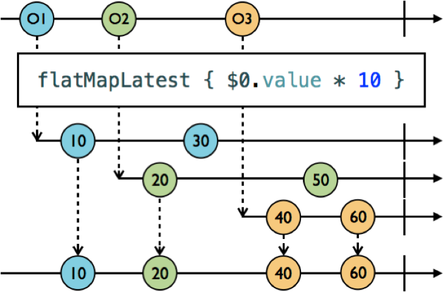

#### c. Observing events
 - `error`: Với 2 toán tử `flatMap` hay `flatMapLatest` khi phát ra `error` hay `completed` thì sẽ đc 
 
 ```
 Unhandled error happened: anError
 ```

- `materialize`: chúng nhận hết các phần tử có thể nhận kể cả `error`. Thay vì nhận các giá trị của `.next`, bây giờ bất cứ `event` nào cũng sẽ biến thành giá trị hết.
	- Và khi trỏ vào thì kiểu dữ liệu là `Observable<Event<Int>>


- `dematerialize`: biến đổi các event thành các giá trị

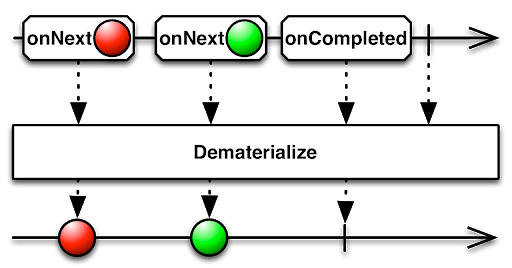

### 3. Combining Operrators
#### a. Prefixing and Concatenating
- `startWith`: thêm 1 hoặc nhiều phần tử trước khi Observable bắt đầu emit dữ liều đi.


```swift
    let bag = DisposeBag()
    
    Observable.of("B", "C")
        .startWith("A")
        .subscribe(onNext: { value in
            print(value)
        })
        .disposed(by: bag)
```

```
A
B
C
```

- `concat`: nối các phần tử của nhiều `sequence obsevable` lại với nhau.

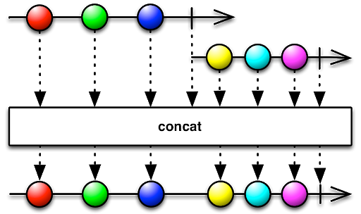

```swift
    let bag = DisposeBag()
    
    let first = Observable.of("A", "B", "C")
    let second = Observable.of("D", "E", "F")
    
    let observable = first.concat(second)
    
    observable
        .subscribe(onNext: { value in
            print(value)
        })
        .disposed(by: bag)
```

```
A
B
C
D
E
F
```

- `concatMap`: 

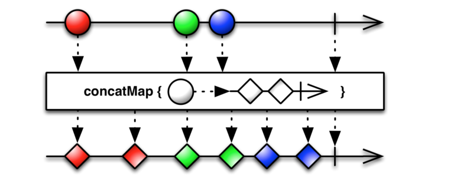

```swift
    let bag = DisposeBag()
    
    let cities = [ "Mien Bac" : Observable.of("Ha Noi", "Hai Phong"),
                   "Mien Trung" : Observable.of("Hue", "Da Nang"),
                   "Mien Nam" : Observable.of("Ho Chi Minh", "Can Tho")]
    
    let observable = Observable.of("Mien Bac", "Mien Trung", "Mien Nam")
        .concatMap { name in
            cities[name] ?? .empty()
        }
    
    observable
        .subscribe(onNext: { (value) in
            print(value)
        })
        .disposed(by: bag)
```

```
Ha Noi
Hai Phong
Hue
Da Nang
Ho Chi Minh
Can Tho
```

#### b. Merge
- `merge`: merge các Observable lại với nhau. Bạn có thể hạn chế được số lượng các Observable được phép merge vào thông qua tham số `.merge(maxConcurent:)`

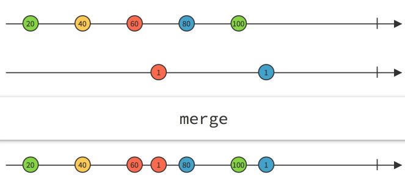

```swift
let chu = PublishSubject<String>()
let so = PublishSubject<String>()

let source = Observable.of(chu.asObserver(), so.asObserver())

let observable = source.merge()
    .materialize()

observable
    .filter({
        guard $0.error == nil else {
            print("Error: \($0.error)")
            return false
        }
        return true
    })
    .dematerialize()
    .subscribe(onNext: { (value) in
        print(value)
    })
    .disposed(by: bag)

chu.onNext("Một")
so.onNext("1")
chu.onNext("Hai")
so.onNext("2")
chu.onNext("Ba")
so.onCompleted()
chu.onError(MyError.anError)
so.onNext("3")
chu.onNext("Bốn")
chu.onCompleted()
```

```
Một
1
Hai
2
Ba
Error: Optional(__lldb_expr_178.MyError.anError)
```

#### c. Combining
- `combineLatest`: toán tử này sẽ phát đi những giá trị là sự kết hợp của các cặp giá trị mới nhất của từng Observable

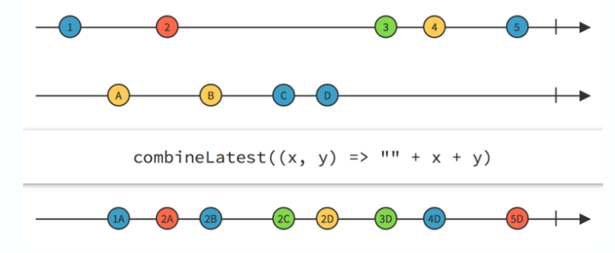

```swift
let chu = PublishSubject<String>()
let so = PublishSubject<String>()

let source = Observable.combineLatest(chu, so)


source
    .subscribe(onNext: { (value) in
        print(value)
    })
    .disposed(by: bag)

chu.onNext("Một")
so.onNext("1")
chu.onNext("Hai")
so.onNext("2")
chu.onNext("Ba")
so.onNext("3")
so.onCompleted()
chu.onNext("Bốn")
chu.onCompleted()
```

```
("Một", "1")
("Hai", "1")
("Hai", "2")
("Ba", "2")
("Ba", "3")
("Bốn", "3")
```

- `combineLatest(_:_:resultSelector:)`: `resultSelector` giúp biến đổi như toán tử `map` và cung cấp 1 closure để biến đổi chúng.

```swift
let chu = PublishSubject<String>()
let so = PublishSubject<String>()

let source = Observable.combineLatest(chu, so) { chu, so in
    "\(chu): \(so)"
}


source
    .subscribe(onNext: { (value) in
        print(value)
    })
    .disposed(by: bag)

chu.onNext("Một")
so.onNext("1")
chu.onNext("Hai")
so.onNext("2")
chu.onNext("Ba")
so.onNext("3")
so.onCompleted()
chu.onNext("Bốn")
chu.onCompleted()
```

```
Một: 1
Hai: 1
Hai: 2
Ba: 2
Ba: 3
Bốn: 3
```

- `zip`: Khi bạn quan tâm đến thứ tự kết hợp theo đúng thứ tự phát đi của từng Observable.

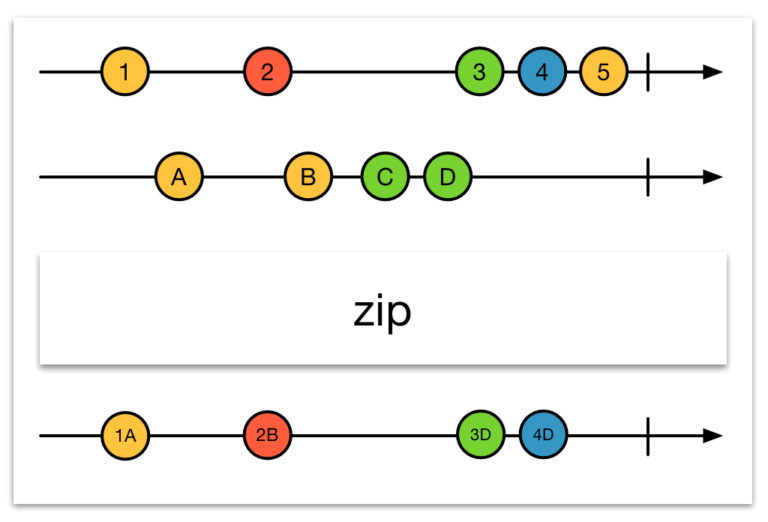

```swift
let chu = PublishSubject<String>()
let so = PublishSubject<String>()


Observable.zip(chu, so) { chu, so in
    "\(chu): \(so)"
}
    .subscribe(onNext: { (value) in
        print(value)
    })
    .disposed(by: bag)

chu.onNext("Một")
so.onNext("1")
chu.onNext("Hai")
so.onNext("2")
chu.onNext("Ba")
so.onNext("3")
so.onCompleted()
chu.onNext("Bốn")
chu.onCompleted()
```

```
Một: 1
Hai: 2
Ba: 3
```

#### d. Trigger
- `withLatestFrom`:

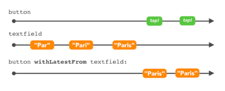

```swift

let textField = PublishSubject<String>()

let observable = button.withLatestFrom(textField)

_ = observable
    .subscribe(onNext: { value in
        print(value)
    })

textField.onNext("Đa")
textField.onNext("Đà Na")

button.onNext(())
textField.onNext("Đà Nẵng")

button.onNext(())
```

```
Đà Na
Đà Nẵng
```

- `sample`: `let observable = textFiled.sample(button)`. Kết quả giống `withLatestFrom`.

#### e. Switches
- `amb`: Nó giải quyết vấn đề là quyết đinh nhận dữ liệu từ nguồn nào. Có nhiều nguồn có thể phát dữ liệu, nguồn nào phát trước thì nó sẽ nhận dữ liệu từ nguồn đó. Các nguồn phát sau sẽ âm thầm bị ngắt kết nối.

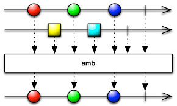

```swift
let bag = DisposeBag()

let chu = PublishSubject<String>()
let so = PublishSubject<String>()

let observable = chu.amb(so)

observable
    .subscribe(onNext: { (value) in
        print(value)
    })
.disposed(by: bag)

so.onNext("1")
so.onNext("2")


chu.onNext("Một")
chu.onNext("Hai")

so.onNext("3")

chu.onNext("Ba")

```

```
1
2
3
```

- `switchLatest`: tương tự flatMapLatest trong bài trước. Thì chỉ nhận dữ liệu phát ra từ Observable cuối cùng tham gia vào.

#### f. Combining elements within a sequence
- `reduce` :
	- `accumulator` là sự rút gon của toán tử `+`, `0` là giá trị ban đầu 

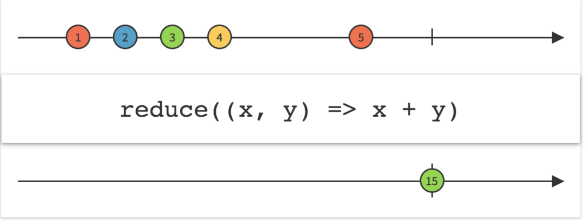

```
let source = Observable.of(1, 2, 3, 4, 5, 6, 7, 8, 9)

let observable = source.reduce(0, accumulator: +)

hoặc 
let observable = source.reduce(0) { $0 + $1 }

hoặc
let observable = source.reduce(0) { summary, newValue in
  return summary + newValue
}
```

- `scan`: giống reduce nhưng thay vì phát ra 1 phần tử cuối cùng thì `scan` nó tính toán và phát đi từng kết quá tính được.

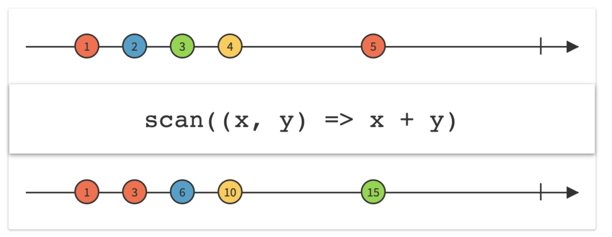


### 4. Time-Based Operators
#### a. Basic with Timer
	